# .NET Core SDK i web API

Ovaj dokument sadrži uputstvo o instalaciji, kao i nastanku prvog projekta koristeći .NET Core SDK.

---

## Pretraživanje na internetu

Verziju za preuzimanje i instalaciju naći ćemo na [sledećem linku](https://dotnet.microsoft.com/). 

Kada se stranica otvori, izabraćemo sledeće:

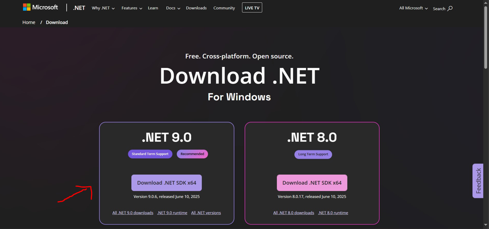

---

## Preuzimanje

Kada se preuzimanje završi, klikom na preuzeti fajl u *downloads*-u pokrenućemo instalaciju.

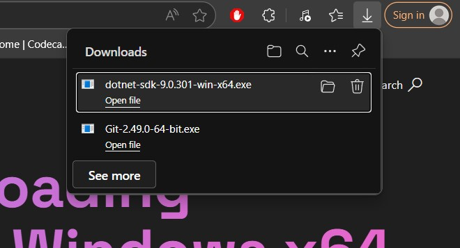

---

## Instalacija

Sada se pojavljuje prozor:

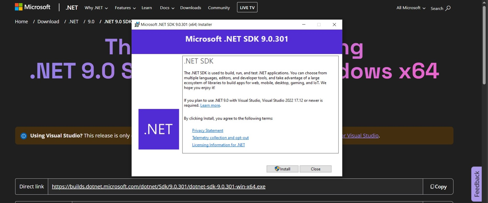

Klikom na **install** pokreće se instalacija.

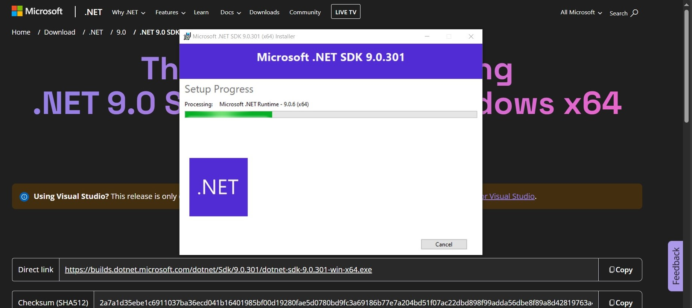

Kada je instalacija (uspešno) gotova, pojaviće se sledeći prozor:

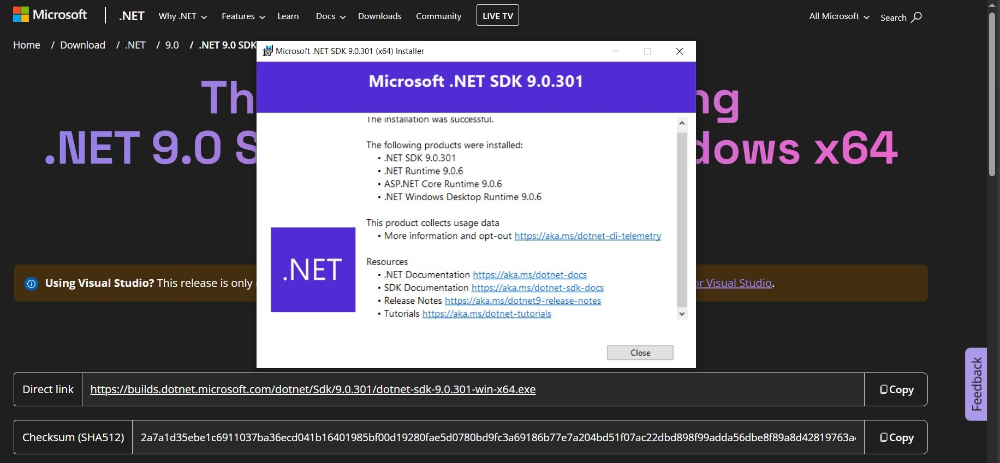

---

## Provera u *command prompt*-u
Da bismo proverili da li je instalacija uspešna, otvorićemo command prompt i uneti komandu **dotnet**.

Posle unete komande *command prompt* bi trebalo da ispiše sledeće:

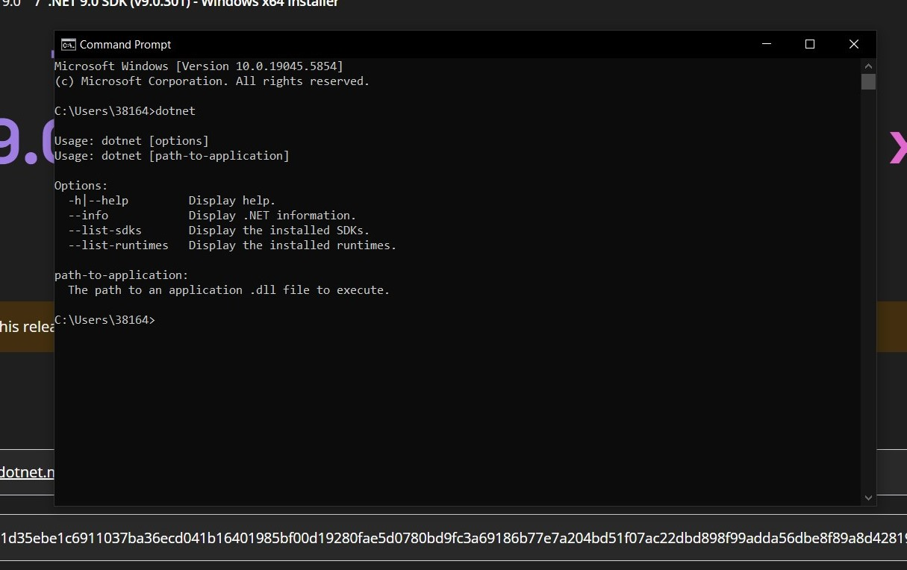

Instalacija je time završena!

# Kreiranje i pokretanje web API projekta
Da bismo to uradili, za početak potrebno je napraviti radni direktorijum.
U okviru tog direktorijuma potrebno je otvoriti *command prompt* i uneti novu komandu koja će kreirati konzolnu aplikaciuju i imenovati je.

Komanda je **dotnet new webapi -n imeprojekta**

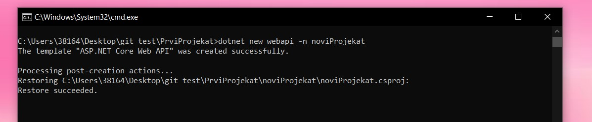

Novi projekat sada je kreiran!

## Build komanda

Kada otvorimo folder našeg projekta, i u njemu *command prompt*, zatim komandu **dotnet build**

Kada je komanda izvršena, pojaviće se sledeći isipis:

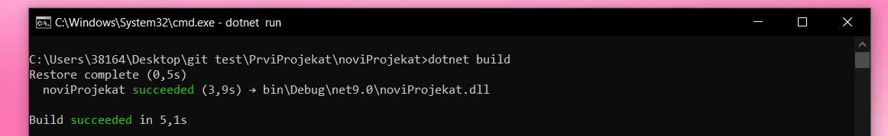

## Run komanda

Dalje, u *command prompt*-u, iz istog fajla, pokrećemo i komandu **dotnet run** koja će pokrenuti naš projekat

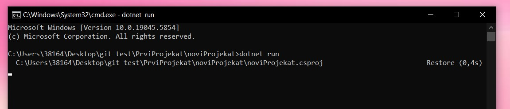

Komanda je izvršena i ispisuje se:

# Povezivanje sa bazom (MongoDB)

## U folderu projekta pokrećemo *command prompt* i unosimo **dotnet add package MongoDB.Driver**.

# Napravimo klasu koja će čitati podešavanja iz appsettings.json.

namespace noviProjekat.Models

{

    public class TodoDatabaseSettings

    {

        public string ConnectionString { get; set; } = null!;

        public string DatabaseName { get; set; } = null!;

        public string CollectionName { get; set; } = null!;

    }

}

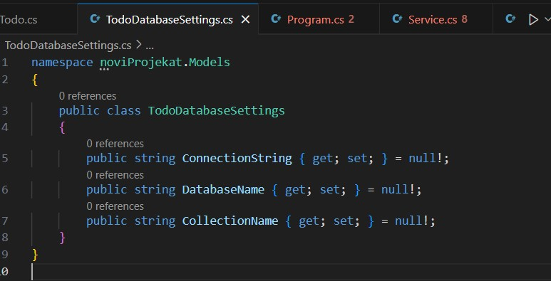

# U fajl appsettings.json upisujemo sledeće: 

"TodoDatabaseSettings" : {

  "ConnectionString" : "mongodb://localhost:27017",

  "DatabaseName" : "TodoDb",

  "CollectionName" : "Todos"

}

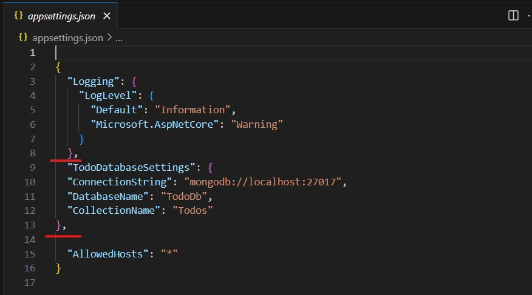

# Zatim pravimo

using MongoDB.Bson;

using MongoDB.Bson.Serialization.Attributes;

namespace noviProjekat.Models

{
    public class Todo

    {

        [BsonId]

        [BsonRepresentation(BsonType.ObjectId)]

        public string? Id { get; set; }

        [BsonElement("Name")]

        public string Name { get; set; } = null!;

        public bool IsComplete { get; set; }
    }

}

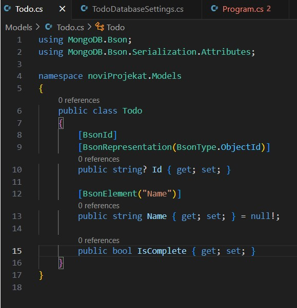

# Napravimo servisni fajl koji koristi MongoDB:

using Microsoft.Extensions.Options;

using MongoDB.Driver;

using noviProjekat.Models;

namespace noviProjekat.Services

{

    public class TodoService

    {

        private readonly IMongoCollection<Todo> _todos;

        public TodoService(IOptions<TodoDatabaseSettings> settings)
        {
            var mongoClient = new MongoClient(settings.Value.ConnectionString);
            var database = mongoClient.GetDatabase(settings.Value.DatabaseName);
            _todos = database.GetCollection<Todo>(settings.Value.CollectionName);
        }

        public async Task<List<Todo>> GetAsync() =>
            await _todos.Find(_ => true).ToListAsync();

        public async Task<Todo?> GetAsync(string id) =>
            await _todos.Find(x => x.Id == id).FirstOrDefaultAsync();

        public async Task CreateAsync(Todo newTodo) =>
            await _todos.InsertOneAsync(newTodo);

        public async Task UpdateAsync(string id, Todo updatedTodo) =>
            await _todos.ReplaceOneAsync(x => x.Id == id, updatedTodo);

        public async Task RemoveAsync(string id) =>
            await _todos.DeleteOneAsync(x => x.Id == id);
    }

}

# Pravimo fajl *controller* 

using Microsoft.AspNetCore.Mvc;

using noviProjekat.Models;

using noviProjekat.Services;

namespace prviProjekat.Controllers;

[ApiController]

[Route("api/[controller]")]

public class TodoController : ControllerBase

{

    private readonly TodoService _todoService;

    public TodoController(TodoService todoService) =>
        _todoService = todoService;

    [HttpGet]
    public async Task<List<Todo>> Get() =>
        await _todoService.GetAsync();

    [HttpGet("{id}")]
    public async Task<ActionResult<Todo>> Get(string id)
    {
        var todo = await _todoService.GetAsync(id);
        if (todo is null) return NotFound();
        return todo;
    }

    [HttpPost]
    public async Task<IActionResult> Post(Todo newTodo)
    {
        await _todoService.CreateAsync(newTodo);
        return CreatedAtAction(nameof(Get), new { id = newTodo.Id }, newTodo);
    }

    [HttpPut("{id}")]
    public async Task<IActionResult> Update(string id, Todo updatedTodo)
    {
        var todo = await _todoService.GetAsync(id);
        if (todo is null) return NotFound();
        updatedTodo.Id = todo.Id;
        await _todoService.UpdateAsync(id, updatedTodo);
        return NoContent();
    }

    [HttpDelete("{id}")]
    public async Task<IActionResult> Delete(string id)
    {
        var todo = await _todoService.GetAsync(id);
        if (todo is null) return NotFound();
        await _todoService.RemoveAsync(id);
        return NoContent();
    }

}

# Već postojećem Program.cs fajlu, sadržaj menjamo sa: 

using noviProjekat.Models;

using Microsoft.AspNetCore.Mvc;

using noviProjekat.Services;

var builder = WebApplication.CreateBuilder(args);

builder.Services.Configure<TodoDatabaseSettings>(

    builder.Configuration.GetSection

    ("TodoDatabaseSettings"));

builder.Services.AddSingleton<TodoService>();

builder.Services.AddControllers();

builder.Services.AddEndpointsApiExplorer();

builder.Services.AddSwaggerGen();

var app = builder.Build();

app.UseHttpsRedirection();

app.UseAuthorization();

app.MapControllers();

app.Run();

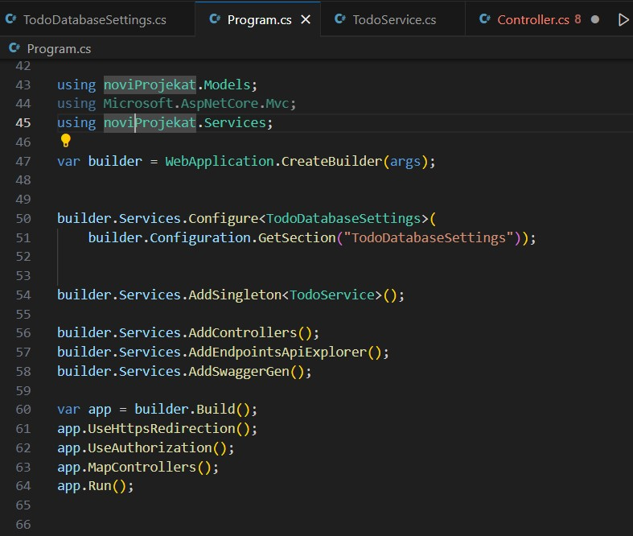

## Pokrećemo projekat sa *dotnet run*

# Linkovi do Microsoft dokumentacije

[Introduction to .NET](https://learn.microsoft.com/en-us/dotnet/core/introduction)

[Create web APIs with ASP.NET Core](https://learn.microsoft.com/en-us/aspnet/core/web-api/?view=aspnetcore-8.0)
