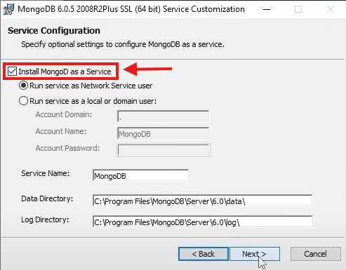
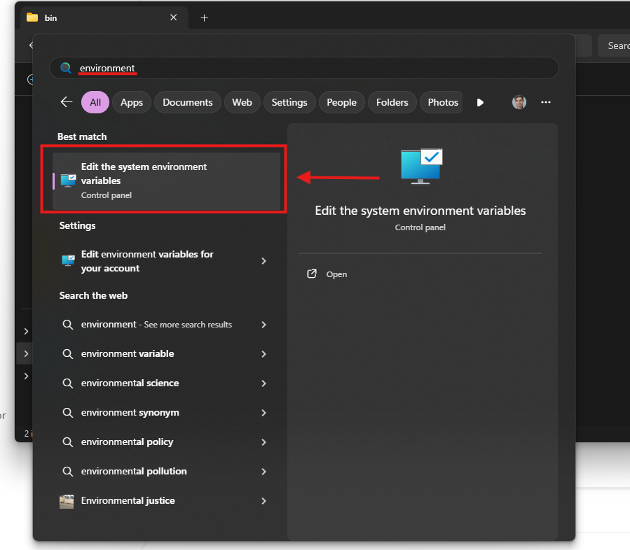
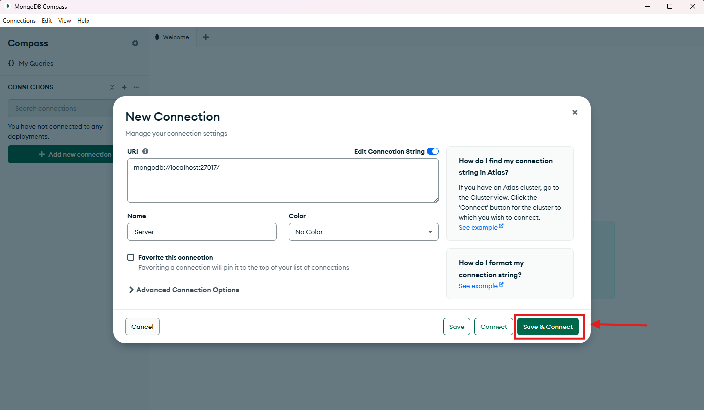

# Instalacija i Povezivanje sa MongoDB Lokalnim Serverom

### MongoDB je popularna NoSQL baza podataka koja koristi dokumentno orijentisani model podataka. Ovaj vodič pokriva instalaciju MongoDB-a na Windows operativnom sistemu i povezivanje na lokalni server.

---

## 1. Preuzimanje i instalacija MongoDB-a

### 1) Posetite zvanični [MongoDB](https://www.mongodb.com/try/download/community) sajt za preuzimanje.
### 2) Izaberite operativni sistem (Windows 64-bit) i preuzmite MSI instalacioni fajl (MongoDB Community Server)

### 3) Pokrenite instalaciju i pratite sledeće korake:
   - Izaberite "Complete" instalaciju

   
   - Ostavite uključenu opciju "Install MongoDB as a Service"

   
   - Po želji instalirajte MongoDB Compass (GUI alat)

   

---

## 2. Preuzimanje i instalacija MongoSH

### 1) Posetite zvanični [MongoSH](https://www.mongodb.com/try/download/shell) sajt za preuzimanje.
### 2) Izaberite operativni sistem (Windows 64-bit) i preuzmite MongoDB Shell

### 3) Raspakujte zip fajl

### 4) Pratite sledece korake:
   - Unutar raspakovanog foldera u folderu bin nalazi se .exe fajl
   
   - Desnim klikom na fajl otvoriće se meni sa opcijom Properties na koju je potrebno kliknuti. Potrebno je kopirati lokaciju prikazanu na slici
   
   - Klikom na Windows dugme se otvara Search bar u kome je potrebno uneti "environment" i izabrati opciju kao na slici
   
   - U tabu Advanced kliknuti dugme Environment Variables

   
   - Kliknuti na New kao na slici.

   
   - Dati unikatno ime varijabli i prelepiti kopiranu lokaciju.

   

## 3. Uputsvo za pokretanje MongoSH u VSC-u

### 1) U "Extensions" tabu u VSC-u instalirati prikazanu ekstenziju


### 2) Pojaviće se novi tab gde se nalazi prikazana komanda


### 3) Kliknite na "Open form" kao na slici


### 4) Save & Connect


### 5) Sa leve strane ce pozeleneti logo servera, i desnim klikom ce se pojaviti meni. Izabrati komandu kao sa slike


## 4. Povezivanje na lokalni MongoDB server pomoću MongoDB Compass-a

### 1) Kliknuti na dugme kao na slici


### 2) U opciju "Uri" uneti lokaciju kao sa slike i kliknuti na "Save & Connect"



## 5. Kreiranje baze preko MongoDB Compass-a

### 1. Nakon povezivanja na lokalni server, pored servera kliknuti na znak "plus"


### 2. Dodati naziv bazi i kolekciji i napraviti bazu klikom na "Create Database"


## 6. Popunjavanje baze podacima preko MongoDB Compass-a

### 1. Kada otvorimo novo-kreiranu bazu, otvoriće nam se prozor kao na slici. Kliknuti na "Add data" pa zatim na "Insert document"


### 2. Uneti podatke u fomratu kao na slici, zatim kliknuti sa desne strane dugme za formatiranje i kliknuti "Insert"


## 7. Testiranje konekcije U mongo shell-u:

```js
use testdb
db.testCollection.insertOne({ime: "Test", vrednost: 123})
db.testCollection.find()
```

