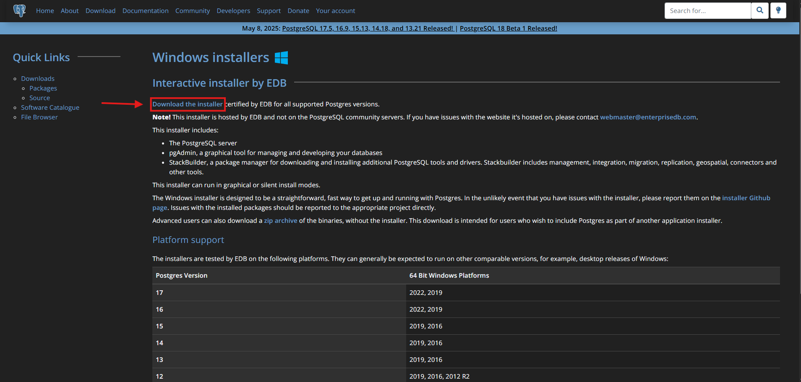
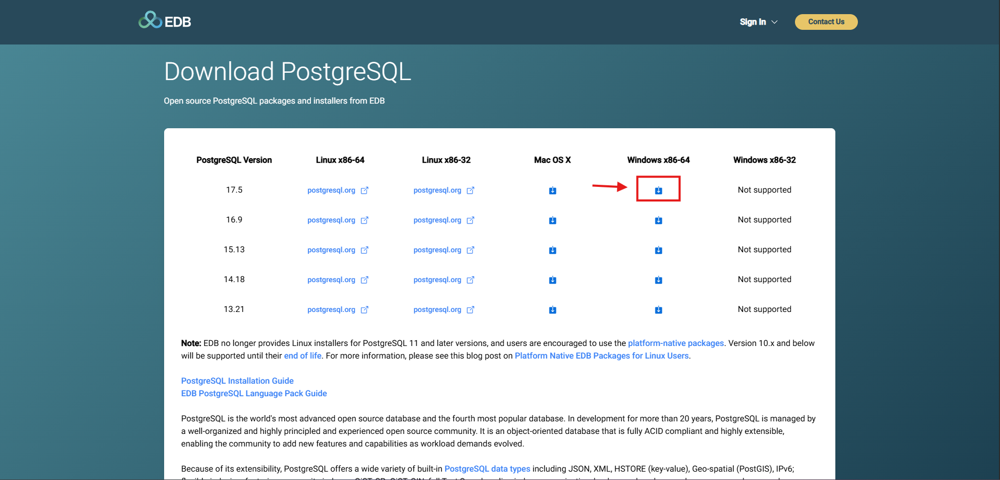
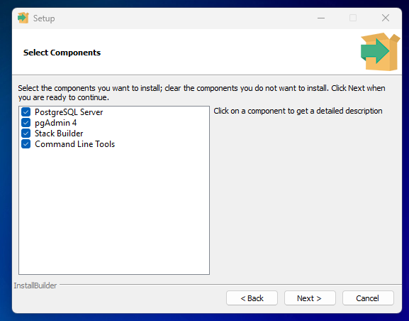
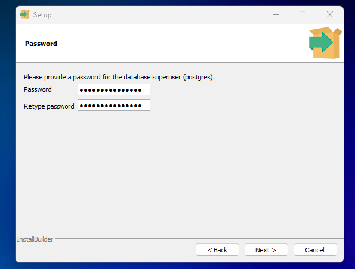
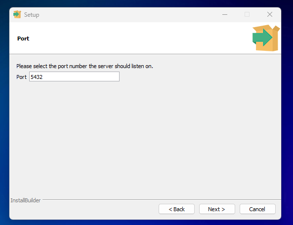
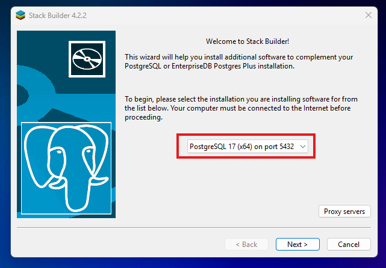
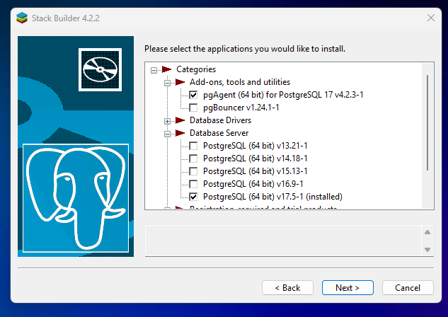

Uputstvo za korišćenje i instalaciju PostgreSQL baze podataka
# 1. ✅ Instalacija PostgreSQL-a

## Za Windows:
- Link za preuzimanje: [PostgreSQL](https://www.postgresql.org/download/windows/)
- Preuzimanje PostgreSQL.

- Nakom preuzimanja nastaviti sa instalacijom

### Proces instalacije
- Pokrenuti instalaciju i ostaviti sve selektovano

- Kreirati i uneti lozinku
- Tokom instalacije zapamti lozinku za korisnika `postgres` (glavni admin nalog).

- Potvrditi kreirani port i nastaviti dalje sa instalacijom klikom na Next

- Na Stack Builder-u izabrati PostgreSQL sa gore odredjenim port-om.

- Selektovati željene aplikacije (potrebno je selektovati bar jedan check-box)

- Pojaviće se još par instalacija koje je potrebno dovršiti.
- Potrebno je restartovati računar kako bi se završio proces instalacije.

## Za Linux (npr. Ubuntu):
sudo apt update
sudo apt install postgresql postgresql-contrib

## Za macOS (preko Homebrew-a):
brew install postgresql
brew services start postgresql

# 2. 🔗 Povezivanje sa PostgreSQL

## Kroz terminal (psql):
psql -U postgres
(Unesi lozinku postavljenu prilikom instalacije.)

## Kroz pgAdmin:
- Otvori pgAdmin.
- Poveži se na lokalni server koristeći korisničko ime `postgres` i lozinku.

# 3. 🏗️ Kreiranje baze podataka

## Preko SQL upita:
CREATE DATABASE ime_baze;

## Preko terminala:
createdb ime_baze

# 4. 📄 Kreiranje tabele

## Poveži se na bazu:
psql -U postgres -d ime_baze

## Napravi tabelu:
CREATE TABLE korisnici (
    id SERIAL PRIMARY KEY,
    ime VARCHAR(50),
    prezime VARCHAR(50),
    email VARCHAR(100) UNIQUE
);

# 5. ✏️ Ubacivanje podataka

INSERT INTO korisnici (ime, prezime, email)
VALUES ('Marko', 'Marković', 'marko@example.com');

# 6. 🔍 Prikazivanje podataka

SELECT * FROM korisnici;

# 7. 🛠️ Ažuriranje i brisanje

## Ažuriranje:
UPDATE korisnici
SET email = 'novi.email@example.com'
WHERE id = 1;

## Brisanje:
DELETE FROM korisnici
WHERE id = 1;

# 8. 📚 Dodatno

- Lista baza: \l
- Lista tabela: \dt
- Prikaz strukture tabele: \d naziv_tabele

# pgAdmin (zvanični alat)
Opis: Službeni GUI alat za PostgreSQL, moćan i sveobuhvatan.

## Prednosti:
- Razvija ga PostgreSQL Global Development Group pa je uvek u koraku sa poslednjim verzijama PostgreSQL-a i nema problema sa kompatibilnošću pri novim izdanjima.

- Otvorenog koda i besplatan.

- Podrška za napredne funkcije (stored procedures, replikaciju, korisnike).

- Radi u browseru kao lokalni web server.

- Bogat skup funkcionalnosti

## Mane: Može biti spor i ponekad "težak" za jednostavne zadatke.

### [Link](https://www.pgadmin.org) ka sajtu

# Kako povezati .NET aplikaciju sa PostgreSQL bazom

## 1. Instalacija Npgsql paketa

dotnet add package Npgsql

## 2. Kreiranje connection string-a

string connectionString = "Host=localhost;Port=5432;Username=postgres;Password=your_password;Database=your_dbname;";

### Zameni vrednosti sa stvarnim podacima:

@ localhost – ako je lokalna baza

@ postgres – korisničko ime

@ your_password – šifra korisnika

@ your_dbname – ime tvoje baze

## 3. Primer konekcije i upita (ADO.NET stil)

using System;
using Npgsql;

class Program
{
    static void Main()
    {
        var connString = "Host=localhost;Port=5432;Username=postgres;Password=your_password;Database=your_dbname;";

        using var conn = new NpgsqlConnection(connString);
        conn.Open();

        using var cmd = new NpgsqlCommand("SELECT * FROM your_table", conn);
        using var reader = cmd.ExecuteReader();
        while (reader.Read())
        {
            Console.WriteLine(reader.GetString(0)); // Prvi kolona (string)
        }
    }
}

## 4. Entity Framework Core (opciono za ORM)

### Instalacija dodatnog paketa:

dotnet add package Npgsql.EntityFrameworkCore.PostgreSQL

### Primer konfiguracije DbContext-a:

public class AppDbContext : DbContext
{
    public DbSet<Korisnik> Korisnici { get; set; }

    protected override void OnConfiguring(DbContextOptionsBuilder optionsBuilder)
    {
        optionsBuilder.UseNpgsql("Host=localhost;Port=5432;Username=postgres;Password=your_password;Database=your_dbname;");
    }
}

public class Korisnik
{
    public int Id { get; set; }
    public string Ime { get; set; }
}

## 5. EF Core migracije i kreiranje baze

dotnet ef migrations add InitialCreate
dotnet ef database update

