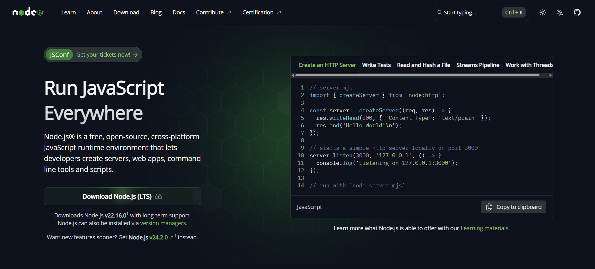
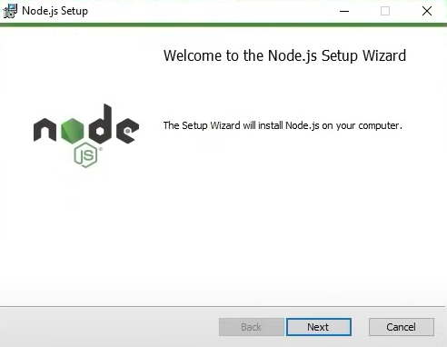
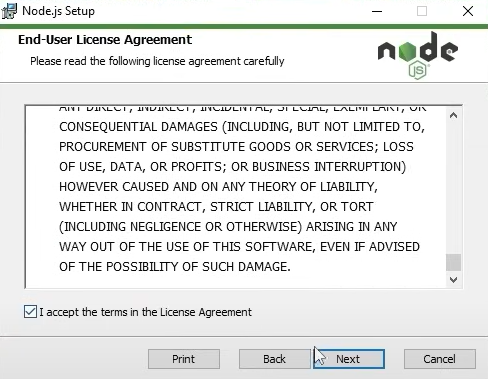
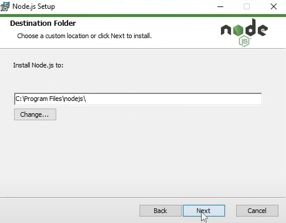
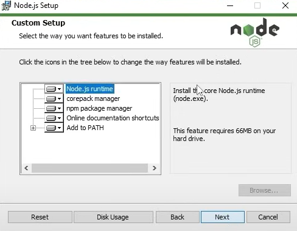
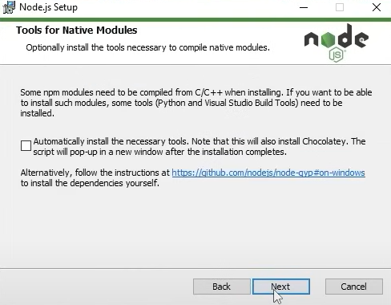
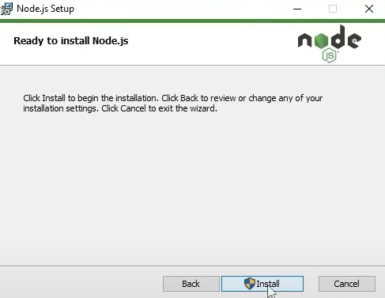
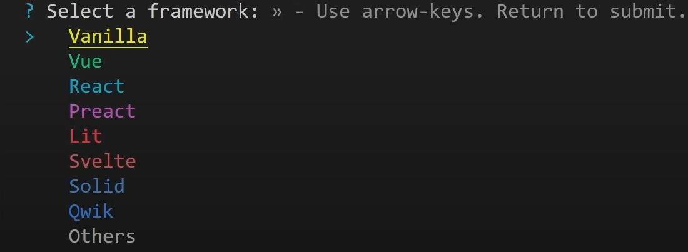
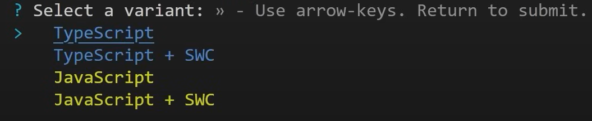

# React

Za instalaciju React-a i React Nativ-a potrebno je prvo instalirati Node.js.

## Instalacija Node.JS

Potrebno je uraditi sledece:

1. Otići na sajt [Node.JS](https://nodejs.org/en) i download-ovati node.js.

2. Kliknuti next i započeti instalaciju.

3. Pročitati licensu i nastaviti dalje klikom na next.

4. Odabrati destinaciju instalacije i kliknuti next.

5. Ovde je moguce odabrati tačne biblioteke koje treba da se instaliraju. Najbolje je ostaviti kako je po default-u i kliknuti next.

6. Kliknuti next.

7. Kliknuti finish i završiti sa instalacijom.

## Pokretanje React-a preko lokalnog hosta

U terminalu je potrebno upisati sledeće komande:

1. npm create vite@latest
- dati ime projektu

2. Strelicam na tastaturi izabrati React

3. Odrabrati programski jezik, JavaScript ili TypeScript

4. Poslednji korak je upisati u terminalu sledeće komande:
1. cd (ime koje smo zadali u prvom koraku)
2. npm install
3. npm run dev

Sada je instaliran React i spreman za korišćenje.

Link do zvanične dokumentacije:

[React](https://react.dev/learn/installation)
