## React Native

Da bi React Native mogao da se koristi potrebno je prvo instalirati JDK 17 i Android Studio.

### Instalacija JDK 17

1. Treba otići na [ovaj](https://www.openlogic.com/openjdk-downloads) link i započeti download za odgovarajuću arhitekturu računara

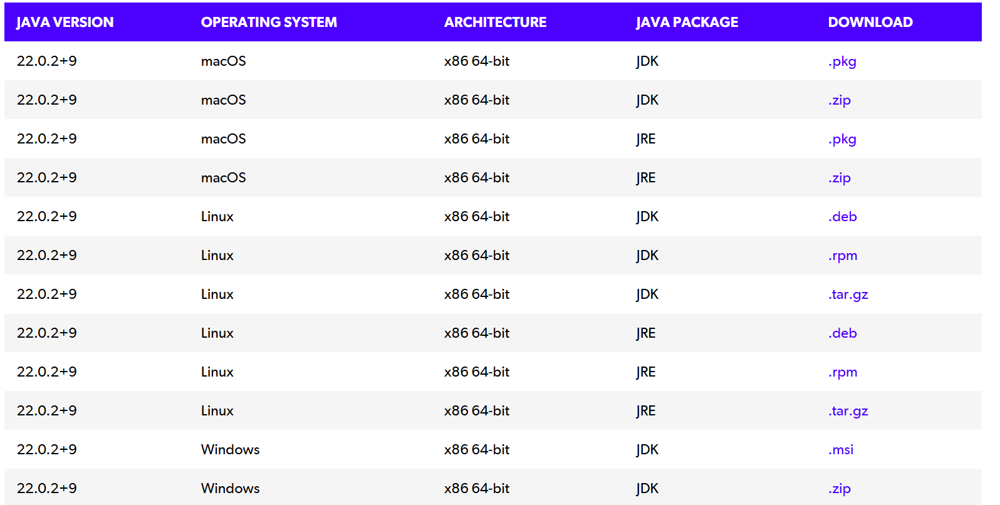

2. Next

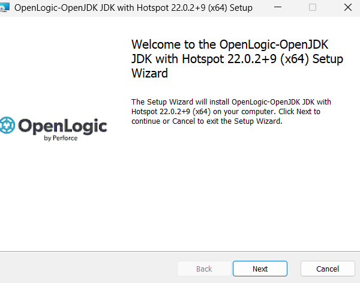

3. Treba pročitati licensu i kliknuti Next

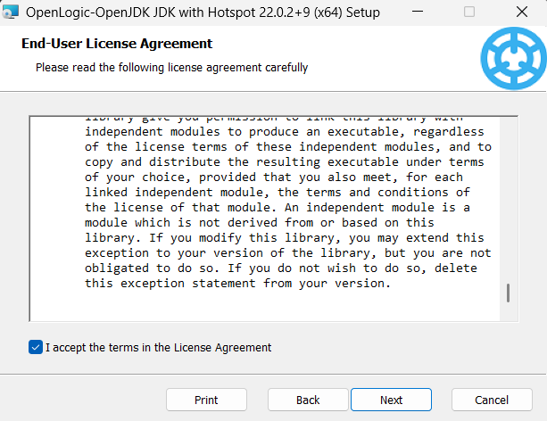

4. Treba odabrati feature tako da izgleda kao na slici

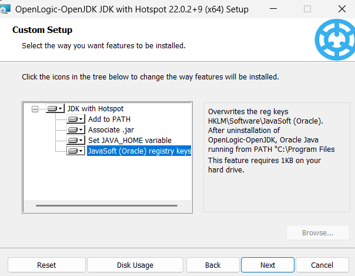

5. Install

JDK 17 je sada uspešno instaliran

### Instalacija i podešavanje Android Studio-a

1. Treba otići na [ovaj](https://developer.android.com/studio) i započeti download

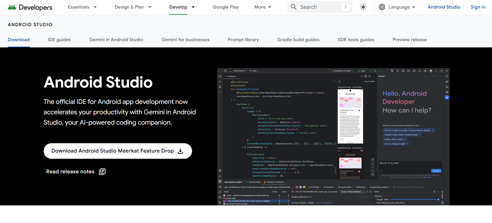

2. Next

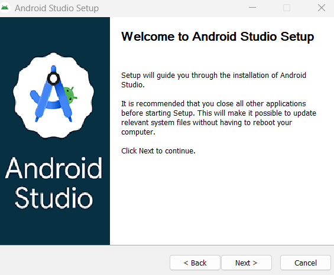

3. Next

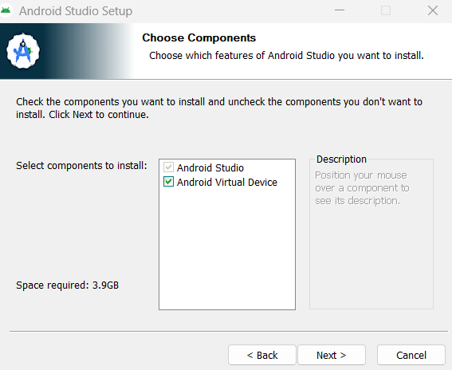

4. Treba izabrati destinacijiu

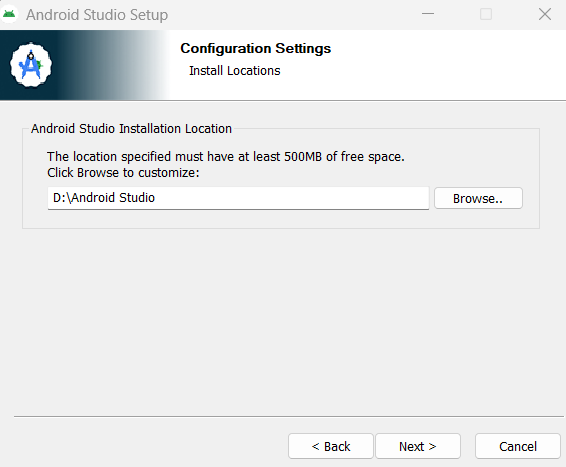

5. Da li želimo da napraimo shortcut i kliknuti na Install

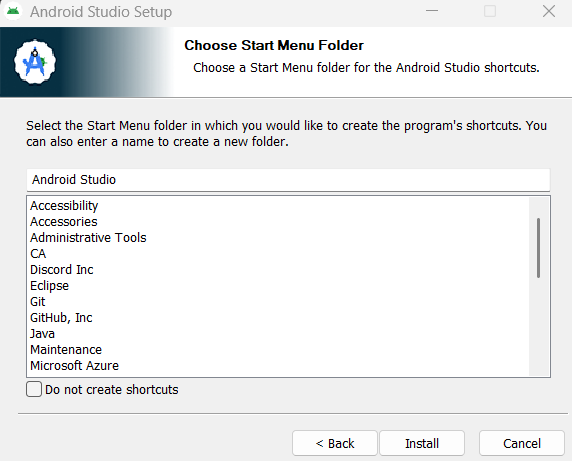

6. Finish

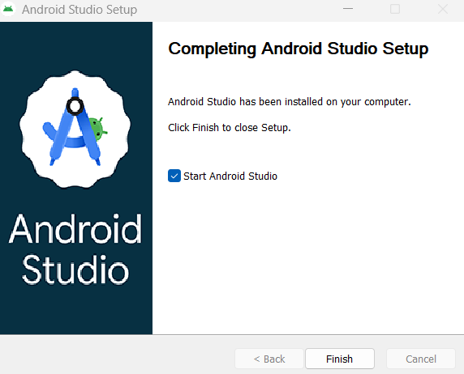

7. Potrebno je startovati Android Studio i ući u podešavanja. U podešavanjima je potrebno da budu selektovana polja kao na sledećim slikama

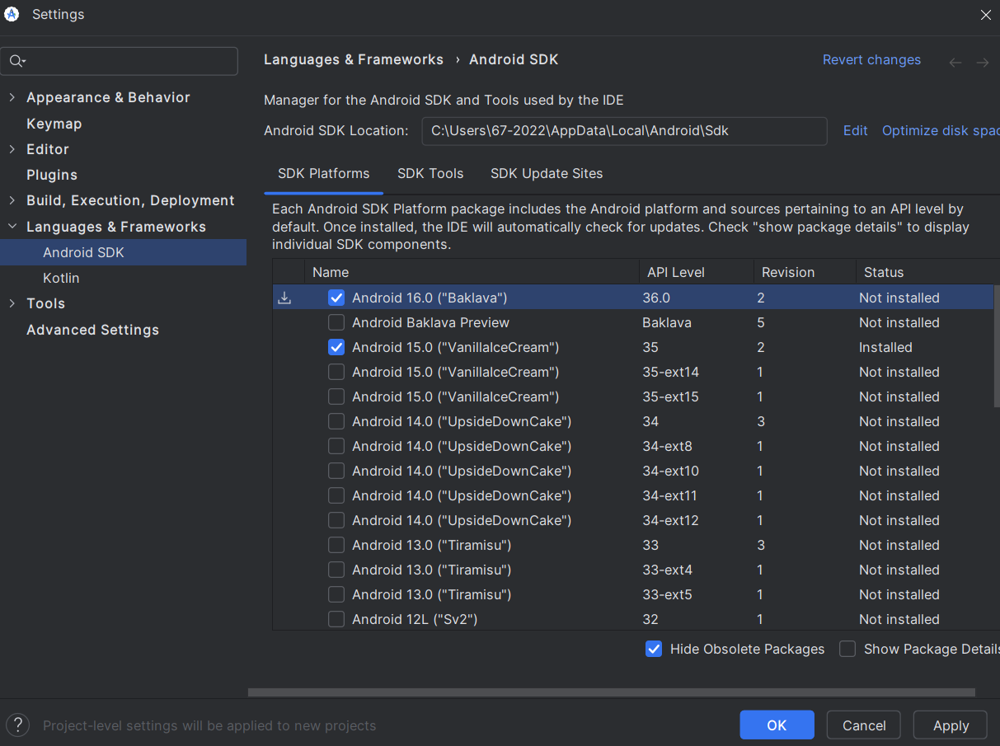

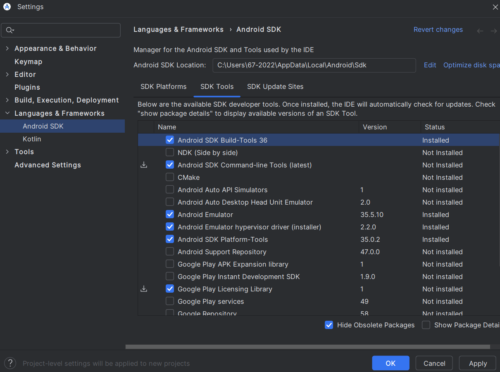

Nakon što su svi koraci završeni napokon je moguće započeti rad u React Native-u.

## Pokretanje React Native

Za pokretanje React Native potrebno je na telefonu instalirati aplikaciju Expo Go.
Nakon toga je potrebno uraditi sledeće:

1.1 Za TypeScript-u projekat ukucati sledeće: npx create-expo-app@latest naziv-aplikacije

1.2 Za JavaScript-u projekat ukucati sledeće: npx create-expo-app@latest naziv-aplikacije --template blank

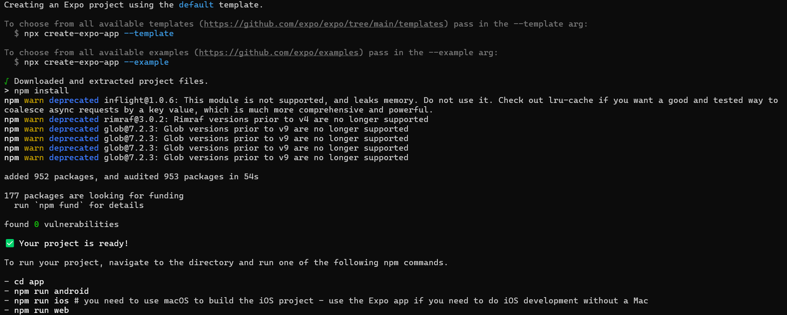

2. Ukucati: cd naziv-aplikacije, a zatim npx expo start

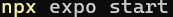

3. Skenirati QR kod putem aplikacije Expo Go

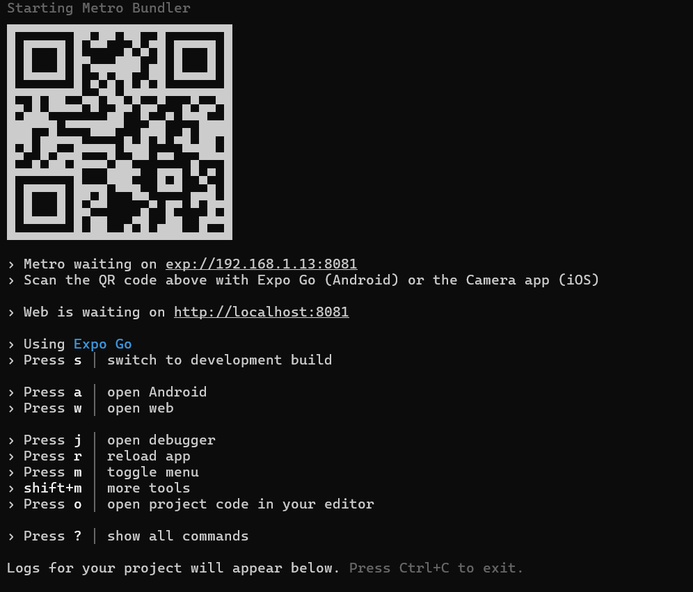

4. Započeti izradu aplikacije editovanjem /app/(tabs)/index.ts

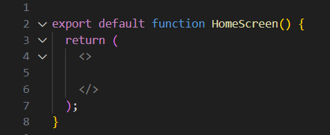

Link do zvanične dokumentacije:

[React Native](https://reactnative.dev/docs/0.74/set-up-your-environment)