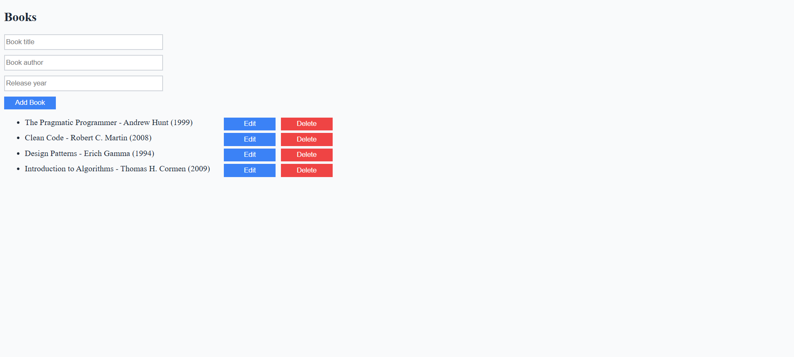
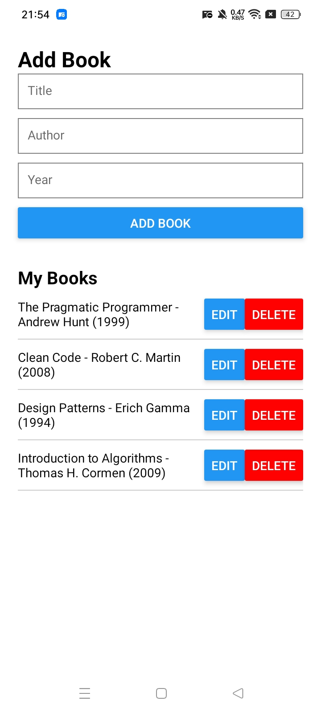

# CRUD aplikacija

Ovo je jednostavna aplikacija koja omogućava CRUD operacije nad bazom knjiga.
Cilj toga je da se savladaju tehnologije koje će kasnije biti upotrebljene za izradu aplikacije za organizaciju dogadjaja.

Backend: dotnet core, mongodb
Frontend: react, react native

## Izgled i funkcionalnosti web aplikacije

1. Moguće je dodati novu knjigu upisivanjem podataka u inputima i klikom na "Add Book"
2. Moguće je obrisati knjigu iz liste klikom na "Delete" pored odgovarajuće knjige
3. Moguće je promeniti podatke o nekoj knjizi klikom na dugme "Edit" pored odgovarajuće knjige i popunjavanjem iskačućeg prozora

## Izgled i funkcionalnosti android aplikacije

NAPOMENA: Pre pokretanja aplikacije potrebno je u App.js promeniti IP adresu kako bi aplikacija radila

1. Moguće je dodati novu knjigu upisivanjem podataka u inputima i pritisnuti na "ADD BOOK"
2. Moguće je obrisati knjigu iz liste pritiskom na "DELETE" pored odgovarajuće knjige
3. Moguće je promeniti podatke o nekoj knjizi klikom na dugme "EDIT" pored odgovarajuće knjige nakon čega će dugme "ADD BOOK" da se promeni u "UPDATE BOOK" koje treba pritisnuti nakon promene podataka o knjizi